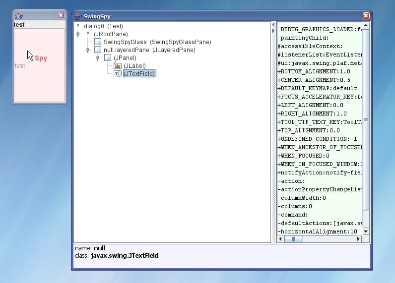

# SwingSpy

**SwingSpy** is a Swing introspector that runs in the background of your application.
It shows a hierarchy of dialog's elements under the cursor, which may be useful during
development or debugging the Swing UI.

## Usage

Add **SwingSpy** jar to classpath and somewhere at the startup of your Swing application add the following code:

```java
    try {
        Class.forName("jodd.swingspy.SwingSpy").getMethod("install").invoke(null);
    } catch (Exception ex) {
        System.err.println("SwingSpy is not installed... " + ex.toString());
    }
```

Once installed, **SwingSpy** may be invoked by pressing the hot-key combination: `ctrl+shift+click`
anytime during the runtime of your application.
When activated, **SwingSpy** shows a dialog with complete hierarchy of Swing components and
some raw object's content on the right. Clicked component will be expanded in the hierarchy three.

While **SwingSpy** is active, user may hover the cursor over swing dialog and component under
the cursor will be highlighted. During that time, cursor will be followed by the word `Spy` and
the component under the mouse will be highlighted.
By clicking the hotkey again over another component, **SwingSpy** will locate it in the hierarchy three.

**SwingSpy** may be exited by closing its dialog. It remains in the background until the next use.

## Screenshots

**SwingSpy** in action over small dialog:



**SwingSpy** in action over real-world complex UI application:


Enjoy Swing!!!